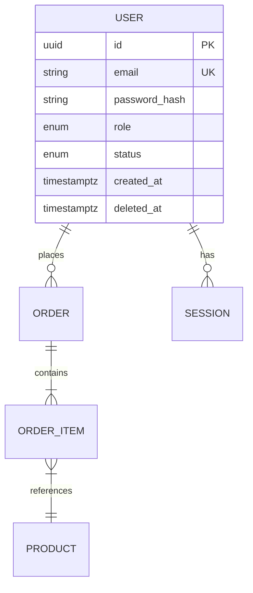

# Basic Design Generation Guide

This guide helps sub-agents write high-quality Basic Design documents from SRS and analysis outputs. Read this before generating any Basic Design document.

---

## Core Principle

Basic Design bridges the SRS ("what") and implementation ("how"). Every design decision must reference an SRS requirement. Every document must cross-reference SRS section/feature/use-case IDs.

**Traceability format:** always end a design choice with `(SRS §X.X)` or `(FR-XX-YY)`.

---

## Document Set Overview

| Document | Depends On | Parallel? |
|----------|-----------|-----------|
| `screen-map.md` | SRS §3, §6.1, `01-screens.md` | Parallel with api-list |
| `api-list.md` | SRS §4, §6.2, `02-apis.md` | Parallel with screen-map |
| `screens/<feature>/screen-*.md` | screen-map.md | Parallel per feature |
| `apis/<feature>/api-*.md` | api-list.md | Parallel per feature |
| `db-design.md` | SRS §5, `03-database.md` | After screen + API details |

---

## Screen Map Writing Tips

### Design System Section

Infer from the codebase in this order:
1. Tailwind config (`tailwind.config.js`) → extract color palette, font family, spacing scale
2. CSS variables (`:root` in global CSS) → extract color tokens
3. Theme config (`theme.ts`, `tokens.js`, MUI theme) → extract design tokens
4. If nothing found: write "TBD — no design system configuration found in source. Values below are placeholders."

Only document what actually exists in the source. Do not invent a design system.

### Navigation Flow Diagram

Use Mermaid `flowchart TD`. Rules:
- Every screen from the Screen Index must appear as a node
- Arrows represent navigation actions (clicks, form submits, redirects)
- Label arrows with the trigger: `-- "click Login" -->` or `-- "submit form" -->`
- Group related screens using `subgraph`:
  ```
  subgraph auth ["Authentication"]
    Login
    Register
    ForgotPassword
  end
  ```
- Show guard conditions: `Login -- "unauthenticated" --> Dashboard` vs. `Root -- "already logged in" --> Dashboard`

### Screen Index Table

| Screen ID | Screen Name | Route | User Role | Feature | Status | Detail Link |
|-----------|------------|-------|-----------|---------|--------|------------|

- Screen ID: reuse from `01-screens.md` (S-01, S-02...)
- Status: Existing (found in source) / Planned (inferred from use cases but not found)

---

## Screen Detail Writing Tips

### ASCII Wireframe Guidelines

Use box-drawing characters for layout. Show spatial relationships, not pixel-perfect designs.

```
┌─────────────────────────────────────────────┐
│ [Logo]                    [Avatar] [Logout] │  ← Header
├──────────┬──────────────────────────────────┤
│          │                                  │
│  Nav     │  Page Title                      │
│  ─────   │  ─────────────────────────────   │
│  Item 1  │  ┌──────────┐  ┌──────────┐     │
│  Item 2  │  │  Card 1  │  │  Card 2  │     │
│> Item 3  │  │          │  │          │     │
│          │  └──────────┘  └──────────┘     │
│          │                                  │
│          │  [Primary Action Button]         │
└──────────┴──────────────────────────────────┘
```

Annotate with `←` arrows to describe regions (not exact pixel sizes unless known).

### Component Inventory Table

| Component | Type | Behavior | Requirement |
|-----------|------|----------|------------|
| Email input | text input | Validates email format on blur; shows inline error | FR-01-03 |
| Login button | primary button | Disabled until form is valid; shows spinner on submit | FR-01-01 |
| "Forgot password?" | link | Navigates to /forgot-password | UC-02 |

Types: `text input` / `password input` / `dropdown` / `checkbox` / `radio group` / `button` / `link` / `table` / `card` / `modal` / `toast` / `badge` / `chart` / `form`

### State & Interaction Table

| User Action | System Response | Outcome |
|-------------|----------------|---------|
| Enters valid email and password, clicks Login | POST /api/v1/auth/login | On 200: store token, redirect to /dashboard |
| Enters invalid credentials, clicks Login | POST /api/v1/auth/login → 401 | Show "Invalid email or password" inline error |
| Clicks Login with empty fields | Client validation triggers | Highlight required fields; do not call API |
| Clicks "Forgot password?" | Navigation | Redirect to /forgot-password |

---

## API Detail Writing Tips

### Request Schema Format

Document every parameter:

```
**Path Parameters**
| Param | Type | Required | Description |
|-------|------|----------|-------------|
| id | UUID | Yes | User ID |

**Query Parameters**
| Param | Type | Required | Default | Description |
|-------|------|----------|---------|-------------|
| page | integer | No | 1 | Page number (1-indexed) |
| limit | integer | No | 20 | Results per page (max 100) |

**Request Body**
| Field | Type | Required | Validation | Description |
|-------|------|----------|-----------|-------------|
| email | string | Yes | Valid email format | User's login email |
| password | string | Yes | Min 8 chars | Plain text; hashed server-side |
```

### Response Schema Format

Always show success AND all error responses:

```
**Success Response (200)**
```json
{
  "access_token": "eyJhbGci...",
  "token_type": "Bearer",
  "expires_in": 900
}
```

**Error Responses**
| HTTP | Error Code | Condition | Response Body |
|------|-----------|-----------|--------------|
| 401 | AUTH_INVALID | Wrong credentials | `{"error": "Invalid email or password", "code": "AUTH_INVALID"}` |
| 422 | VALIDATION_ERROR | Request fails validation | `{"error": "Validation failed", "code": "VALIDATION_ERROR", "fields": {...}}` |
| 429 | AUTH_LOCKED | Account locked | `{"error": "Account locked", "code": "AUTH_LOCKED", "retry_after": 1800}` |
| 500 | SERVER_ERROR | Unexpected error | `{"error": "Internal server error", "code": "SERVER_ERROR"}` |
```

### Business Rules Format

Write each rule as a numbered statement:

1. User account must have `status = 'active'` (SRS FR-01-05)
2. Failed attempts counter increments on each 401 response
3. After 5 failures within 15 minutes, account is locked for 30 minutes (SRS FR-01-06)
4. Successful login resets the failure counter
5. Access token lifetime is 15 minutes; refresh token lifetime is 7 days

---

## Database Design Writing Tips

### ER Diagram

Use Mermaid `erDiagram`. Map every entity and every relationship from `03-database.md`:



Relationship cardinality:
- `||--||` one-to-one
- `||--o{` one-to-many (zero or more)
- `||--|{` one-to-many (one or more)
- `}|--|{` many-to-many

### Table Breakdown Format

````markdown
### `users` — User Accounts

**Purpose:** Stores all registered user accounts. Central entity for auth and ownership.
**Source Requirement:** SRS §5, FR-01-01

| Column | Type | Nullable | Default | Constraints | Description |
|--------|------|----------|---------|-------------|-------------|
| id | UUID | No | gen_random_uuid() | PK | Unique user identifier |
| email | VARCHAR(255) | No | — | UNIQUE, NOT NULL | Login identifier; must be verified before access |
| password_hash | VARCHAR(255) | No | — | NOT NULL | bcrypt hash (cost=12). Never returned in API responses |
| role | ENUM('user','admin') | No | 'user' | NOT NULL | Controls access permissions |
| status | ENUM('active','suspended','pending') | No | 'pending' | NOT NULL | Account lifecycle state |
| created_at | TIMESTAMPTZ | No | NOW() | NOT NULL | Record creation timestamp |
| updated_at | TIMESTAMPTZ | No | NOW() | NOT NULL | Last modification timestamp |
| deleted_at | TIMESTAMPTZ | Yes | NULL | — | Soft delete marker. NULL = active record |

**Indexes:**
| Index Name | Columns | Type | Purpose |
|-----------|---------|------|---------|
| users_pkey | id | B-tree (PK) | Primary key lookup |
| users_email_key | email | B-tree (UNIQUE) | Login lookup, uniqueness enforcement |
| users_deleted_at_idx | deleted_at | B-tree | Efficiently filter active records (`WHERE deleted_at IS NULL`) |

**Foreign Keys:**
- None (users is a root entity)

**Relationships:**
- `sessions.user_id → users.id` — one user has many sessions
- `orders.user_id → users.id` — one user places many orders
````

### Relationships Narrative

After all tables, write a plain-language section:

> **Key Data Flows:**
>
> **Authentication flow:** A `User` creates a `Session` on login. The session stores the refresh token and device info. API requests validate the JWT, which encodes `user.id` and `user.role`. On logout, the session is soft-deleted.
>
> **Order flow:** A `User` creates an `Order`. Each order has one or more `OrderItem` rows, each referencing a `Product`. Order status transitions from `pending → paid → shipped → delivered`, enforced at the application layer.

---

## Quality Checklist

Before finishing any Basic Design document, verify:

- [ ] Every screen in screen-map.md has a corresponding detail file
- [ ] Every API endpoint in api-list.md has a corresponding detail file
- [ ] Every SRS requirement referenced actually exists in the SRS (check the ID)
- [ ] Every Mermaid diagram is syntactically valid
- [ ] All error codes in API details match what was found in the feature deep-dives
- [ ] DB design covers every table from `03-database.md` (no silent omissions)
- [ ] Sensitive fields (passwords, tokens, PII) are explicitly noted as sensitive
- [ ] No design decisions made without tracing to an SRS requirement
