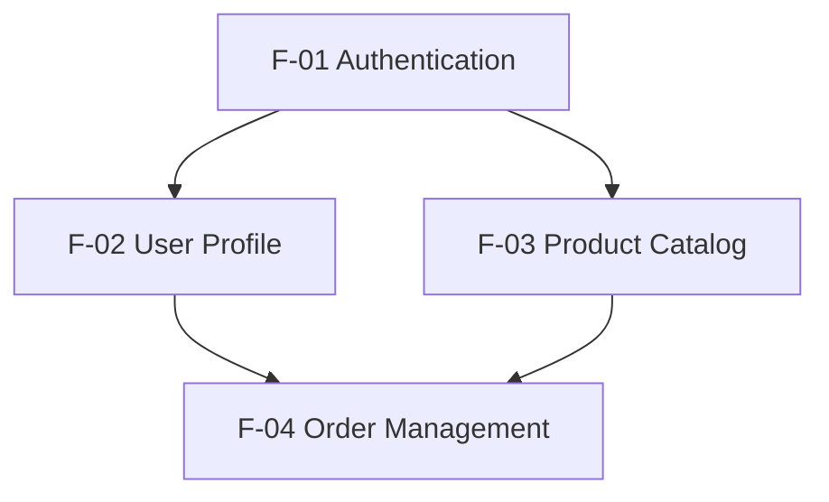

# Schema: 04-features.md

Output file for Step 1.3 — Feature List & Dependency Graph.

---

```markdown
# Feature List & Dependency Graph

**Analyzed:** <ISO datetime>

## Dependency Diagram



## Feature Register

| ID | Name | Description | Screens | APIs | Entities | Depends On | Batch |
|----|------|------------|---------|------|----------|-----------|-------|
| F-01 | Authentication | Allow users to register, log in, and manage sessions | S-01, S-02, S-03 | POST /auth/login, POST /auth/register | User, Session | — | 1 |
| F-02 | User Profile | View and update personal account information | S-04 | GET /users/me, PATCH /users/me | User | F-01 | 2 |
| F-03 | Product Catalog | Browse and search available products | S-05, S-06 | GET /products, GET /products/:id | Product, Category | — | 1 |
| F-04 | Order Management | Place and track orders | S-07, S-08 | POST /orders, GET /orders/:id | Order, OrderItem | F-01, F-03 | 2 |

## Execution Batches for Step 1.4

List features grouped by batch. Agents within each batch run in parallel; batches run sequentially.

- **Batch 1** (no dependencies): F-01, F-03
- **Batch 2** (depends on Batch 1 only): F-02, F-04
- **Batch 3** (depends on Batch 2): F-05, F-06
```
