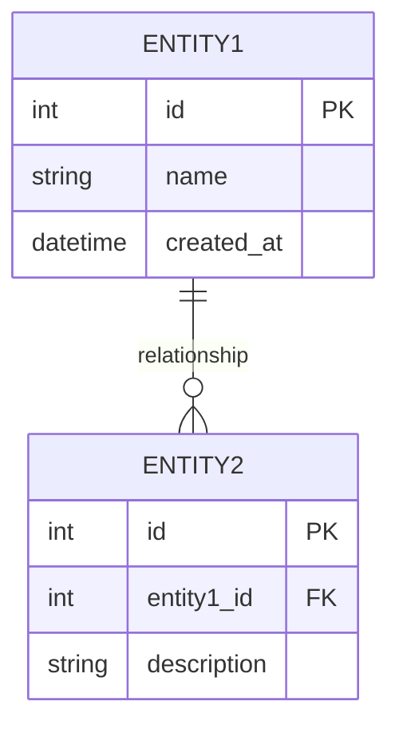

# Database Design: <Project Name>

> This document explains the database structure and purpose of each table, helping developers, QA, and DBAs understand data relationships and design rationale.

**Source Requirements:** SRS Section 5 (Data Requirements)

---

## 1. Overview

**Database Management System:** <PostgreSQL/MySQL/Other>

**Purpose:**
> Describe the main purpose of the database and what business flows it supports.

**Source Requirements:**
> Reference SRS sections that informed this design.
- SRS Section 4: <Functional Requirements>
- SRS Section 5: <Data Requirements>
- SRS Section 7: <Quality Attributes>

---

## 2. Entity-Relationship Diagram

> Provide a visual representation of tables and their relationships.

---

## 3. Table List and Roles

| Table Name | Purpose | Main Relationships |
|------------|---------|-------------------|
| `<table_name>` | <Purpose description> | <Relationship description> |
| `<table_name>` | <Purpose description> | <Relationship description> |

---

## 4. Detailed Table Descriptions

### 4.1 `<table_name>`

**Purpose:**
> Describe what this table stores and its role in the system.

**Primary Key:** `<field_name>` (<data_type>)

**Key Fields:**

| Field Name | Data Type | Constraints | Description |
|------------|-----------|-------------|-------------|
| `<field_name>` | `<type>` | `<UNIQUE/NOT NULL/CHECK>` | <Description> |
| `<field_name>` | `<type>` | `<constraints>` | <Description> |

**Important Design Decisions:**
- <Decision 1 and rationale>
- <Decision 2 and rationale>

**Foreign Keys:**
- `<field_name>` → `<referenced_table>.<referenced_field>` (<relationship description>)

**Indexes:**
- `<index_name>` on `<field_name>` (<purpose>)

**Business Rules:**
- <Business rule 1>
- <Business rule 2>

---

### 4.2 `<table_name>`

**Purpose:**
> Describe what this table stores.

**Primary Key:** `<field_name>` (<data_type>)

**Key Fields:**

| Field Name | Data Type | Constraints | Description |
|------------|-----------|-------------|-------------|
| `<field_name>` | `<type>` | `<constraints>` | <Description> |

**Foreign Keys:**
- `<field_name>` → `<referenced_table>.<referenced_field>`

**Indexes:**
- `<index_name>` on `<field_name>`

---

## 5. Relationships Summary

> Document all relationships between tables.

| From Table | Relationship Type | To Table | Description |
|------------|-------------------|----------|-------------|
| `<table1>` | One-to-Many | `<table2>` | <Description> |
| `<table1>` | Many-to-Many | `<table2>` | <Description> |

---

## 6. Data Integrity Rules

**Constraints:**
- <Constraint 1>
- <Constraint 2>

**Validation Rules:**
- <Validation rule 1>
- <Validation rule 2>

**Referential Integrity:**
- <Cascade/restrict/set null behavior>

---

## 7. Performance Considerations

**Indexes:**
> List indexes for query optimization.

| Index Name | Table | Fields | Purpose |
|------------|-------|--------|---------|
| `<index_name>` | `<table>` | `<fields>` | <Purpose> |

**Query Optimization Notes:**
- <Note 1>
- <Note 2>

---

## 8. Security Considerations

**Access Control:**
- <Access control requirement 1>
- <Access control requirement 2>

**Data Protection:**
- <Protection measure 1>
- <Protection measure 2>

---

## 9. Future Extensions

> Document potential future enhancements or changes.

- <Extension 1>
- <Extension 2>

---

## 10. Notes

**Migration Strategy:**
> Reference migration tool or approach (e.g., Flyway, Liquibase).

**Testing Considerations:**
- <Testing note 1>
- <Testing note 2>

