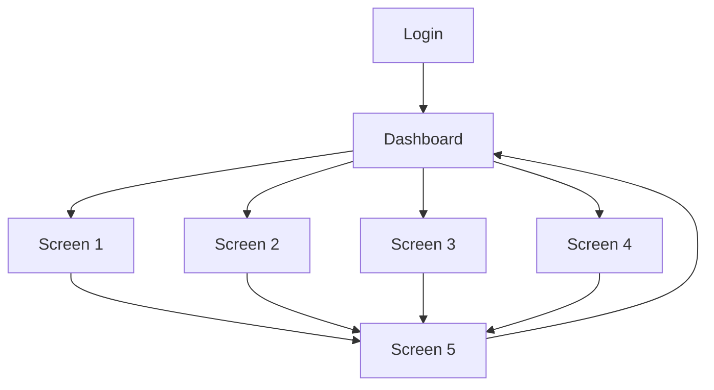

# Screen Map: <Project Name>

> This document provides the design system overview, screen map (navigation flow), screen index, and common UI building blocks. For detailed layout and interactions per screen, see the Detail Screen document for each screen.

**Source Requirements:** SRS Section 6.1 (User Interfaces)

---

## 1. Design System Overview

**Color Palette:**
- Primary: <Color>
- Secondary: <Color>
- Accent: <Color>
- Background: <Color>
- Text: <Color>

**Typography:**
- Headings: <Font family, sizes>
- Body: <Font family, sizes>
- Buttons: <Font family, sizes>

**Spacing:**
- Base unit: <8px/4px>
- Component spacing: <Guidelines>

---

## 2. Screen Map (Navigation Flow)

> This diagram shows the relationships and navigation flow between all screens in the application.

**Mermaid Flowchart:**


**Detailed Navigation Map:**
```
┌─────────────────────────────────────────────────────────────────┐
│                    Screen Relationship Map                      │
└─────────────────────────────────────────────────────────────────┘

Entry Point: Login Screen
    │
    ├─→ Dashboard (Main Hub)
    │   │
    │   ├─→ Screen 1 (via Navigation Menu)
    │   │   ├─→ Screen 1A (via Action Button)
    │   │   └─→ Screen 1B (via Action Button)
    │   │
    │   ├─→ Screen 2 (via Navigation Menu)
    │   │   └─→ Screen 2A (via Modal/Detail View)
    │   │
    │   ├─→ Screen 3 (via Navigation Menu)
    │   │
    │   └─→ Screen 4 (via Navigation Menu)
    │       └─→ Screen 4A (via Action Button)
    │
    └─→ [Other Entry Points]
```

**Navigation Patterns:**
- **Primary Navigation:** <Menu type - Sidebar/Top Nav/Bottom Nav>
- **Secondary Navigation:** <Breadcrumbs/Back buttons>
- **Modal/Overlay Screens:** <List screens that appear as modals>
- **Deep Links:** <Screens accessible via direct URL>

**User Role-Based Navigation:**
- **<Role 1>:** <List accessible screens>
- **<Role 2>:** <List accessible screens>
- **<Role 3>:** <List accessible screens>

---

## 3. Quick Reference: Common UI Elements

> Use these ASCII patterns as building blocks when describing components in detail screens.

**Card Component:**
```
┌─────────────────────────────┐
│ [Icon] Title                 │
│ ───────────────────────────  │
│ Content text here            │
│ [Action Button]              │
└─────────────────────────────┘
```

**Button:**
```
┌──────────────┐
│ Button Text  │
└──────────────┘
```

**Input Field:**
```
┌──────────────────────────────┐
│ Label                        │
│ ┌──────────────────────────┐ │
│ │ Input text here          │ │
│ └──────────────────────────┘ │
└──────────────────────────────┘
```

**Table/List:**
```
┌──────┬──────────┬──────────┐
│ Col1 │ Col2     │ Col3     │
├──────┼──────────┼──────────┤
│ Data │ Data     │ Data     │
│ Data │ Data     │ Data     │
└──────┴──────────┴──────────┘
```

**Modal/Dialog:**
```
        ┌─────────────────────┐
        │ [X] Modal Title     │
        ├─────────────────────┤
        │                     │
        │ Modal Content        │
        │                     │
        │ [Cancel] [OK]       │
        └─────────────────────┘
```

---

## 4. Screen Index

| Screen | Section (Detail Screen) | User Role | Purpose |
|--------|-------------------------|-----------|---------|
| <Screen 1> | 5 | <Role> | <Purpose> |
| <Screen 2> | 6 | <Role> | <Purpose> |
| <Screen 3> | 7 | <Role> | <Purpose> |

> Each screen has a corresponding section in the Detail Screen document with wireframe, layout, and interactions.

---

## 5. Responsive Design Considerations

**Breakpoints:**
- Mobile: <Width>
- Tablet: <Width>
- Desktop: <Width>

**Mobile Adaptations:**
- <Adaptation 1>
- <Adaptation 2>

**Tablet Adaptations:**
- <Adaptation 1>
- <Adaptation 2>

---

## 6. Common UI Patterns

**Buttons:**
- Primary: <Style>
- Secondary: <Style>
- Danger: <Style>

**Forms:**
- Input fields: <Style>
- Validation messages: <Style>
- Submit buttons: <Style>

**Tables/Lists:**
- Row style: <Style>
- Hover state: <Style>
- Selection: <Style>

**Modals/Dialogs:**
- Size: <Dimensions>
- Overlay: <Style>
- Close button: <Position>

---

## 7. Accessibility Considerations

**Keyboard Navigation:**
- <Requirement 1>
- <Requirement 2>

**Screen Reader Support:**
- <Requirement 1>
- <Requirement 2>

**Color Contrast:**
- <Requirement>

---

## 8. Visual Resources

**Design Tools:**
> Reference tools used (Figma, Axure, Uizard, etc.)

**Wireframe Files:**
- Low-fidelity: `<path/to/wireframe.png>` or `<Figma Link>`
- High-fidelity: `<path/to/mockup.png>` or `<Figma Link>`

**Prototype Links:**
> Add links to interactive prototypes when available.
- Interactive prototype: `<Figma/InVision/Other Link>`

**Image Placeholders:**
> For markdown documents, you can reference images:
```markdown


```

---

## 9. Notes

**Visual Guidelines:**
> Tips for creating better visual mockups:
- Use consistent spacing (8px grid system)
- Show actual content examples, not just "Lorem ipsum"
- Include error states and empty states
- Show hover/active states for interactive elements

**Future Enhancements:**
- <Enhancement 1>
- <Enhancement 2>
