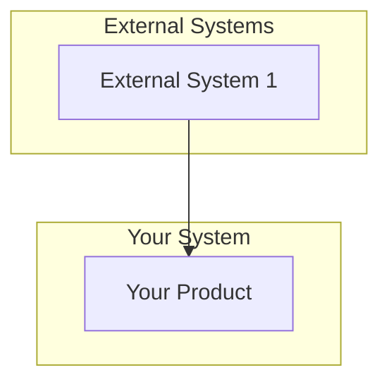

## 2. Overall Description

> This section presents a high-level overview of the product and the environment in which it will be used, the anticipated users, and known constraints, assumptions, and dependencies.

### 2.1 Product Perspective

> Describe the product's context and origin. If this SRS defines a component of a larger system, state how this software relates to the overall system and identify major interfaces.

**Product Context:**

> Describe whether this is a new product, replacement, upgrade, or component of a larger system.

**System Relationships:**

> If part of a larger system, describe relationships and interfaces.

**Context Diagram:**

> Optionally include a context diagram.

### 2.2 User Classes and Characteristics

> Identify the various user classes that you anticipate will use this product and describe their pertinent characteristics.

| User Class     | Description | Characteristics | Priority          |
| -------------- | ----------- | --------------- | ----------------- |
| <User Class 1> |             |                 | Primary/Secondary |

### 2.3 Operating Environment

> Describe the environment in which the software will operate.

**Hardware Platform:**

- <Hardware requirement 1>
- <Hardware requirement 2>

**Operating Systems:**

- <OS 1> 
- <OS 2>

**Software Components:**

- <Software component 1>
- <Software component 2>

### 2.4 Design and Implementation Constraints

> Describe any factors that will limit the options available to the developers.

**Technology Constraints:**

- **Programming Languages:** 
- **Databases:** 
- **Frameworks:**

**Corporate/Regulatory Policies:**

- <Policy 1>
- <Policy 2>

### 2.5 Assumptions and Dependencies

> List any assumed factors that could affect the requirements stated in the SRS. Identify any dependencies the project has on external factors.

**Assumptions:**

- <Assumption 1>
- <Assumption 2>

**Dependencies:**

- <Dependency 1>
- <Dependency 2>

