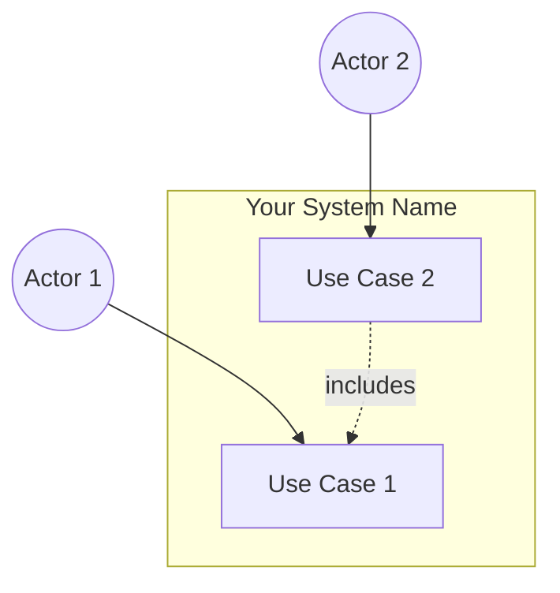

## 3. Use Cases

> This section documents how users interact with the system to achieve specific goals. Use cases provide detailed interaction flows that guide implementation and testing, bridging high-level user needs and detailed system requirements.
>
> **Structure:** Split into **two parts**: (1) this index file — diagrams and list with links; (2) **one file per use case** in `03-use-cases/` (e.g. `03-use-cases/uc-01-<name>.md`). Generate each use case detail from the **use-case-detail template** (`3-use-case-detail-template.md`).

### 3.1 Use Case Diagrams

> Provide visual representations of actors, use cases, and their relationships using UML use case diagrams. Use Mermaid diagrams or equivalent notation. Include system boundary, actors (stick figures or actor notation), use cases (ovals), and relationships (associations, includes, extends).

**System Context Diagram:**

> Provide visual representations of actors, use cases, and their relationships using UML use case diagrams. Use Mermaid diagrams or equivalent notation.

---

### 3.2 List Use Case

> Provide a comprehensive list of all use cases in the system.

| Use Case ID | Use Case Name | Actor(s) | Priority        | Status         |
| ----------- | ------------- | -------- | --------------- | -------------- |
| UC-01       |               |          | High/Medium/Low | Draft/Approved |
| UC-02       |               |          | High/Medium/Low | Draft/Approved |
| UC-03       |               |          | High/Medium/Low | Draft/Approved |

**Use Case Relationships:**

> Document relationships between use cases (includes, extends, generalizes).

| Use Case | Relationship Type | Related Use Case | Description |
| -------- | ----------------- | ---------------- | ----------- |
| UC-02    | includes          | UC-01            |             |

