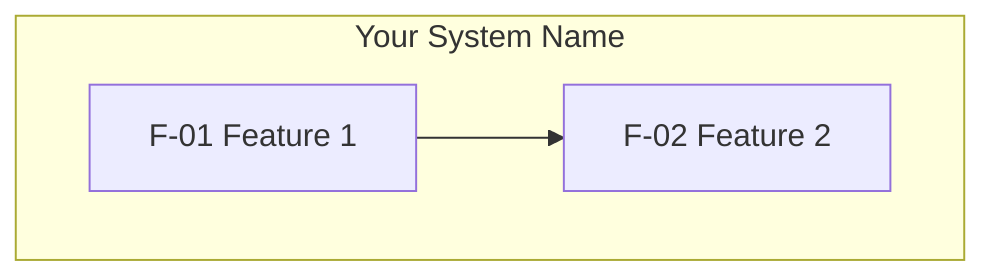

## 4. System Features

> This section catalogs **what the system delivers** as discrete features: names, ownership by role, priority, status, and links to deeper specs. Use **Section 3** for interaction flows (use cases); use this section for a **feature-level** view of the product or subsystem.
>
> **Structure:** (1) this index — optional diagram(s) and the register table; (2) **one file per feature** in `04-system-features/` (for example `04-system-features/f-01-<name>.md`). Generate each detail from **`4-system-feature-detail-template.md`**. Keep **System Feature ID** values stable and consistent with the detail doc.

### 4.1 Feature Diagram (Optional)

> Use Mermaid when a picture helps: group features by area, show **depends on** / **enables**, or map actors to features. Replace the placeholder below or add more diagrams like in Section 3.

---

### 4.2 List of System Features

> Provide a complete register: one row per feature ID. Use **Summary** for a single scannable sentence; put requirements, acceptance criteria, and edge cases in the linked detail file.

*Optional: one line of context (e.g. how this list maps to modules, epics, or releases).*

| System Feature ID | System Feature Name | Summary | Related use case IDs | Actor(s) | Priority        | Status         | Link to Detail |
| ----------------- | ------------------- | ------- | -------------------- | -------- | --------------- | -------------- | -------------- |
| F-01              |                     |         | UC-01, UC-02         |          | High/Medium/Low | Draft/Approved | [F-01 Detail](04-system-features/f-01-<slug>.md) |
| F-02              |                     |         |                      |          | High/Medium/Low | Draft/Approved | [F-02 Detail](04-system-features/f-02-<slug>.md) |

### 4.3 Feature Relationships (Optional)

> Document **depends on**, **includes**, **extends**, or other relationships between features so the register stays easy to read.

| Feature | Relationship Type | Related Feature | Description |
| ------- | ----------------- | --------------- | ----------- |
| F-02    | depends on        | F-01            |             |
