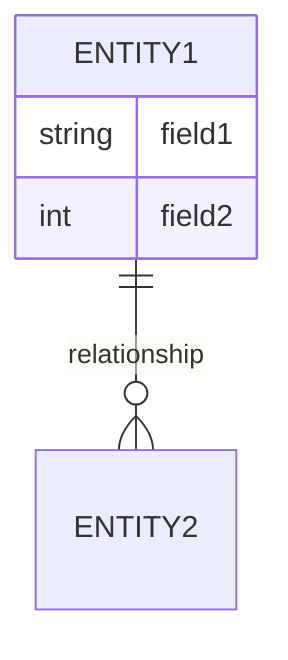

## 5. Data Requirements

> This section describes various aspects of the data that the system will consume as inputs, process in some fashion, or create as outputs.

### 5.1 Logical Data Model

> A data model is a visual representation of the data objects and collections the system will process and the relationships between them.

**Entity-Relationship Diagram:**
> Include an ER diagram or data model here.

**Data Objects:**
| Data Object | Description | Key Attributes |
|-------------|-------------|----------------|
| <Object 1> | <Description> | <Attributes> |

### 5.2 Data Dictionary

> The data dictionary defines the composition of data structures and the meaning, data type, length, format, and allowed values for the data elements.

**Note:** If the data dictionary is extensive, consider storing it as a separate document and referencing it here.

| Element Name | Data Type | Length | Format | Allowed Values | Description |
|--------------|-----------|--------|--------|----------------|-------------|
| <Element 1> | <Type> | <Length> | <Format> | <Values> | <Description> |

### 5.3 Reports

> If your application will generate any reports, identify them here and describe their characteristics.

| Report ID | Report Name | Description | Frequency | Audience |
|-----------|-------------|-------------|-----------|----------|
| RPT-01 | <Report Name> | <Description> | <Frequency> | <Audience> |

### 5.4 Data Acquisition, Integrity, Retention, and Disposal

> Describe how data is acquired and maintained. State requirements regarding data integrity, retention, and disposal.

**Data Integrity:**
- **Validation:** <Validation requirements>
- **Backups:** <Backup requirements>

**Data Retention:**
- <Retention policy 1>
- <Retention policy 2>

**Data Disposal:**
- <Disposal policy 1>
- <Disposal policy 2>

